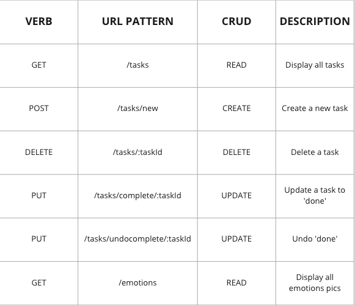

# Welcome to the *Regulate* App!

## Description

Maintaining a consistent, daily routine is vital in making a child with special needs such as autism feel safe, supported, and regulated. This is an app designed for these children to help them keep track of their daily tasks, which will help them develop good habits that promote independence. 

Users can create tasks for a specific time, and the tasks will be categorized based on selection of Morning, Afternoon, or Evening. Users are able to 'complete' a task. If that's done accidentally, a user can also 'undo' the complete function. Users can also delete tasks from their schedule.

The second element of the app is an emotion identifier. Users are able to click on a picture or word depicting an emotion and that specific emotion will be rendered on the right side of the screen. That way, users can share the emotion they've identified with their caregivers so they can better express how they are feeling.

Coming soon:
* Calm environment creator
* User account creation, with login/logout and saved schedule
* Chat functionality
* Task editing
* Different styling themes based on user's age

## App Interface

<!-- Homepage:

Create A Task:

Schedule:

Emotion Finder:
 -->

## Initial Wireframes of the app

## User Flow and User Stories

Users: children with special needs, learning or attention challenges, or any child who would benefit from a routine schedule.

* As a user, I want to create daily tasks under my overall "schedule" and check these tasks off as I go throughout the day
* As a user, I want to be able to undo a task I accidentally completed.
* As a user, I want to be able to delete a task.
* As a user, I want to be able to quickly identify emotions that I don't have words for, using pictures and words.

## Tech stack used:
* Typescript
* React
* Express.js, Node.js
* Mongo, Mongoose, MongoDB Atlas
* Bulma, CSS

## Plan

Up to this point in the program, I hadn't yet learned or worked with Typescript. I was initially excited to implement this framework in my app development. I specifically chose Typescript because it's a very popular technology used in the industry and I wanted to add it as a new tool in my software engineering toolbelt. Overall I found it intuitive and relatively easy to learn, and it definitely made the debugging process much more efficient.

## Approach Taken

I started this project by first diving into learning Typescript. I watched tutorials online, read through the documents, and did a few Codeacademy lessons. Once I felt comfortable enough to get started, I spun up my basic React app. Then I installed my necessary dependencies. I sketched out my basic routes for MVP and created my RESTful routing chart. I thought through how I would want to structure my model and which attributes to choose. Once I had the basic files and routes for the frontend, I constructed the backend with Mongo. I skipped over having a local backend and hooked my server straight up to the Mongo Atlas DB. Once they were connected, I created the basic Task creation route. After many bugs and lots of trial and error, I finally figured out the routes and was able to successfully create a task and post it to the database.

Then I worked on rendering the schedule full of tasks. I figured out the input needs (dropdown for time of day, time for specific time of the task). Sorting the array of task objects chronologically was challenging. I had to convert the time (inputed as a string) to total minutes and then sorted it based on the minutes attribute. And then to create the emotion finder, I created a new state and set the current state to whatever picture/word combo was clicked. 

I styled the pages with a combination of Bulma and heavy in-line styling, which wasn't ideal but gave me the styling functionality I needed. I'm hoping to refactor the style code more efficiently in the future.

## Dependencies Installed:
* "@testing-library/jest-dom"
* "@testing-library/react"
* "@testing-library/user-event"
* "@types/dotenv"
* "@types/jest"
* "@types/node"
* "@types/react"
* "@types/react-dom"
* "axios"
* "bulma"
* "cors"
* "dotenv"
* "react"
* "react-dom"
* "react-router-dom"
* "react-scripts"
* "typescript"
* "web-vitals"

## RESTful Routing

## ERDs

## MVP
* Single user app
* User can add a new task for either morning or evening (dropdown option)
* User can see a list of their 'to-do' tasks with the ability to check off a task as completed
* User can delete a task
* Emotion finder page renders a short list of emotion pictures and user can click one picture which will be shown larger in a card next to the list

## Stretch goals
* Add date, day of week, and current time to home page
* Add day of the week capability to tasks and only render 
* User auth: users can create account with username and password and log in/out
* Calming environment functionality
* Ability to create a new environment element
* Animations instead of static images for background choices for environments
* Ability of user to input a url for video to render in calming environment
* Fun, colorful, calming styling
* Chat feature so users can keep in touch with each other through the app
* Links to other resources for families with kids with special needs

## Unsolved Problems:

There were a few problems I wasn't able to solve in the project time:

* I worked hard to render a functional burger within the navbar but was never able to figure it out with Bulma. I plan to potentially ditch Bulma and either go with Bootstrap or style completely with raw CSS.
* I wasn't able to add an edit feature to tasks, hoping to do so in the future
* I also wasn't able to figure out how to have the entire task div change color when the task is completed.

My biggest hurdles were the chronological ordering of tasks; learning how to render date, time, and day of week; and figuring out how to set state for the emotion finder so the correct things are rendered when an emotion is clicked on. Solving these issues required a lot of smart googling, discussing with classmates and the instruction team, and countless trials and errors.

## Post Project Reflection:

Overall, I thoroughly enjoyed working on this project. I learned so much about the debugging process, especially when it comes to working with brand new frameworks and technologies. Though I do enjoy group work, I actually think I learned more working on my own because it forced me to learn and understand the innerworkings of EACH route, each file, each page, so that I could work on the functionality. Productive coding really does require perseverance, patience, and creative problem-solving. 

## Future Plans

* More components, better organization
* User auth functionality
* CSS styling
* Edit task feature
* Chat feature for users to message with each other
* Different style themes based on age of user
* Calm environment creator
* Task color change on complete action
* Add external resource links